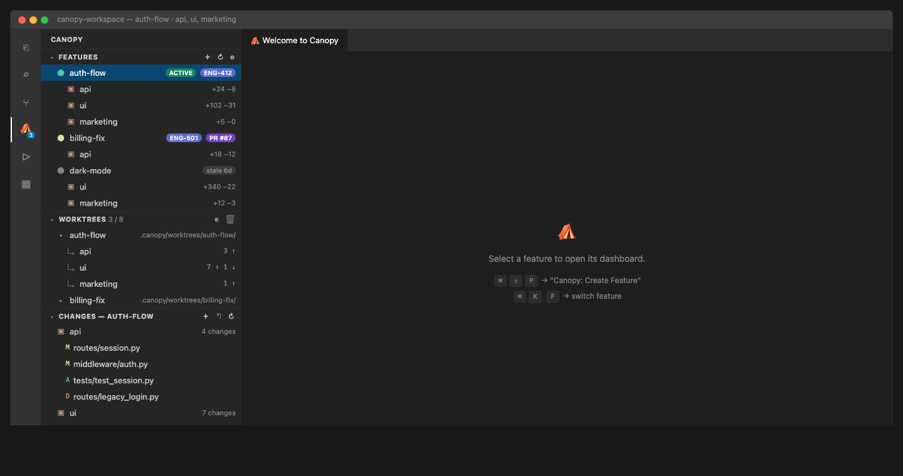
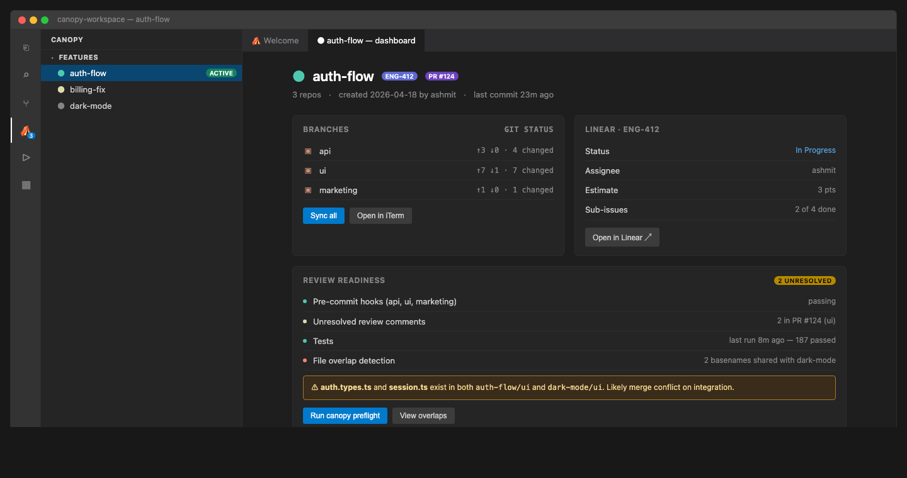
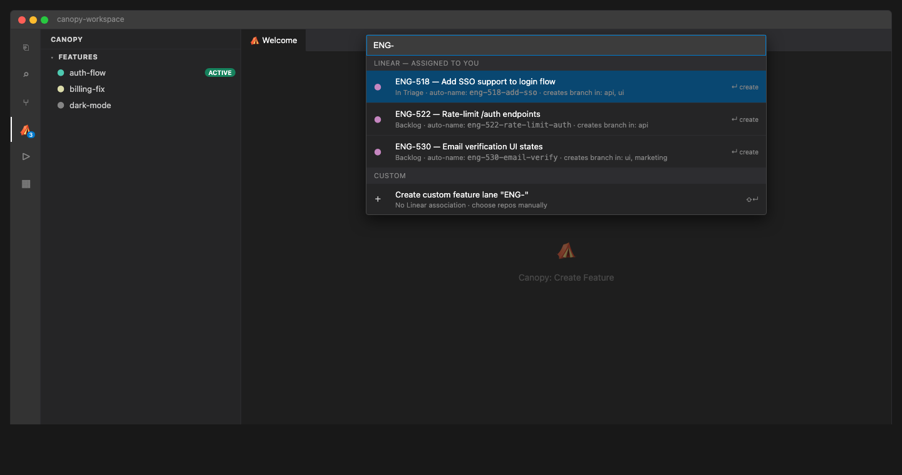

# Canopy — Multi-Repo Worktree Manager

**A single sidebar for every feature lane, worktree, and per-repo diff in a multi-repo workspace.**

Canopy coordinates real Git branches and worktrees across multiple repositories — no proprietary abstractions, no virtual branches. This extension gives you a VSCode-native UI on top of the [Canopy CLI + MCP server](https://github.com/ashmitb95/canopy).

---

## Features

### Feature lanes, worktrees, and per-repo changes — one sidebar

The activity-bar entry gives you four collapsible sections backed by the same MCP tools the Canopy CLI uses. Features show live ahead/behind counts, worktrees show the `max_worktrees` budget, Changes reflects M/A/D/? status per repo, and Review Readiness is a traffic light per lane.

### Per-feature dashboard with Linear + GitHub context

Click any feature to open a webview showing branch state across every repo, linked Linear issue, open PRs, pre-commit status, cross-repo file overlap warnings, and recent commits interleaved across all worktrees.

### Linear-aware Create Feature quick pick

`Cmd+Shift+P` → *Canopy: Create Feature*. The picker auto-suggests lane names from your assigned Linear issues and creates matching branches + worktrees across the repos you select.

---

## Install

1. Install the extension from the VSCode Marketplace.
2. Open a folder containing a `canopy.toml` file.
3. If the sidebar offers **Install Canopy for me**, click it — the extension sets up a managed venv at `~/.canopy-vscode/venv` and installs the Canopy backend. Otherwise `pipx install canopy` from a terminal also works.

That's it. The extension spawns one `canopy-mcp` process per workspace and routes every UI action through its 30+ tools.

---

## Settings

| Setting | Default | What it does |
| --- | --- | --- |
| `canopy.canopyMcpPath` | `canopy-mcp` | Path to the `canopy-mcp` executable. Set an absolute path if auto-detection fails. |
| `canopy.refreshIntervalSeconds` | `30` | How often to poll Canopy for updated state. `0` disables periodic refresh. |
| `canopy.pythonPath` | *(empty)* | Optional Python 3.10+ binary used by *Install Backend*. Leave empty to auto-detect. |

---

## Links

- **[Canopy on GitHub](https://github.com/ashmitb95/canopy)** — CLI, MCP server, and full architecture docs
- **[Changelog](CHANGELOG.md)**
- **[Report a bug](https://github.com/ashmitb95/canopy/issues)**

MIT licensed.
